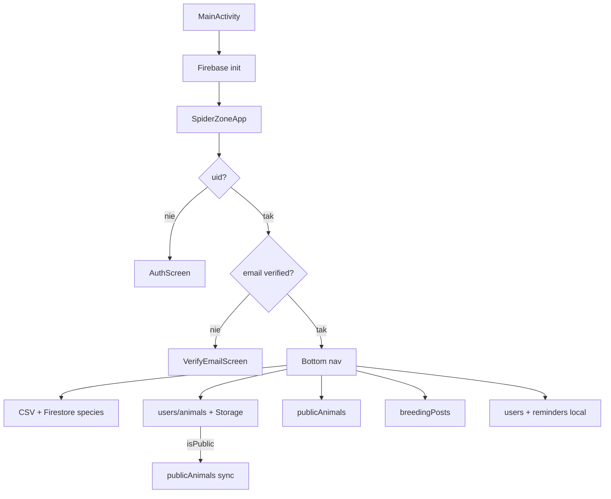

# Działanie techniczne aplikacji

> Jak SpiderZone działa „pod maską”: startup, auth, dane, sekrety, build, deploy.  
> Oparte na stanie repozytorium (Android Kotlin Compose + szkielet Flutter).

**Projekt Firebase:** `spiderzone-d112d`  
**Package Android:** `com.example.spiderzone`

---

## 1. Architektura runtime (Android)

```text
MainActivity.onCreate
  ├── FirebaseApp.initializeApp()
  ├── configureFirebaseStorageBucket()   # gs:// z google-services / manifest
  ├── createReminderChannel()            # kanał notyfikacji Android
  └── setContent { SpiderZoneRoot() }
        ├── AppThemePreferences          # jasny/ciemny/system
        └── SpiderZoneApp()
              ├── [bramka] brak uid → AuthScreen
              ├── [bramka] email niezweryfikowany → VerifyEmailScreen
              └── Scaffold + bottom nav (6 zakładek)
```

Główna logika UI i `SpiderZoneRepository` są w jednym pliku:  
`app/src/main/java/com/example/spiderzone/MainActivity.kt` (~3800 linii).

---

## 2. Sekrety i pliki konfiguracyjne

### Co jest wrażliwe

| Plik / wartość | Lokalizacja | W git? | Opis |
|----------------|-------------|--------|------|
| `google-services.json` | `app/google-services.json` | **Tak (obecnie)** | Klucze API Android, project_id, app_id — z Firebase Console |
| `local.properties` | root | **Nie** (`.gitignore`) | Ścieżka do Android SDK na Twoim PC |
| `firebase_options.dart` | `flutter_app/lib/core/firebase/` | Tak (placeholder) | Po `flutterfire configure` — prawdziwe klucze |
| Hasła użytkowników | — | — | Tylko w Firebase Auth (nie w repo) |
| Keystore release | poza repo | **Nie** | Do podpisywania APK/AAB na produkcję — utwórz lokalnie |

### Zasady bezpieczeństwa

1. **Repo publiczne** → dodaj `app/google-services.json` do `.gitignore` i trzymaj kopię lokalnie / w 1Password / w Firebase Console (pobierz ponownie).
2. **Repo prywatne** → obecny stan jest akceptowalny dla solo dev, ale i tak unikaj udostępniania repo osobom trzecim.
3. **Nigdy** nie commituj: keystore (`.jks`), hasła keystore, service account JSON z uprawnieniami admina.
4. Klucze w `google-services.json` są ograniczone pakietem aplikacji — i tak nie wrzucaj ich publicznie bez potrzeby.

### Stałe w kodzie (nie sekrety, ale ważne)

```kotlin
// MainActivity.kt
private const val FIREBASE_PROJECT_ID = "spiderzone-d112d"
```

```xml
<!-- AndroidManifest.xml -->
android:value="spiderzone-d112d.firebasestorage.app"
```

---

## 3. Firebase — co jest włączone

| Usługa | Użycie w aplikacji |
|--------|-------------------|
| **Authentication** | Email + hasło, weryfikacja email, reset hasła |
| **Cloud Firestore** | Gatunki, profile, hodowla, społeczność, rozmnażanie, przypomnienia |
| **Cloud Storage** | Avatary, zdjęcia/filmy pupili |
| **Cloud Functions** | Nie używane (0 kosztów) |
| **FCM (push)** | Nie zaimplementowane — tylko lokalne alarmy |

**Plan:** Firebase Spark (darmowy) — limity: [Firebase Pricing](https://firebase.google.com/pricing).

---

## 4. Przepływy danych (szczegóły)

### 4.1 Autentykacja

```text
Rejestracja → createUserWithEmailAndPassword
           → createUserProfile (Firestore users/{uid})
           → sendEmailVerification
           → (opcjonalnie) upload avatara → Storage avatars/

Logowanie → signInWithEmailAndPassword
         → jeśli rememberMe: zapis email w SharedPreferences (spiderzone_auth)

Reset → sendPasswordResetEmail
```

**Bramki UI:**

- `repository.currentUserId() == null` → ekran logowania.
- `!repository.isCurrentUserEmailVerified()` → ekran „zweryfikuj email”.
- Inaczej → główna aplikacja.

### 4.2 Gatunki

```text
Start aplikacji (IO):
  TerrariumSpeciesCatalog.load(context)
    → czyta app/src/main/assets/terrarium_species_care_template.csv

Po zalogowaniu:
  SeedData.seedSpeciesIfEmpty()     # jeśli Firestore species puste
  repository.species()               # orderBy latinName, limit 100
  mergeSpeciesLists(csv, firestore)
```

Wyszukiwanie: lokalne filtrowanie po `latinName` / `commonName` (bez Algolia).

### 4.3 Hodowla

```text
Zapis: users/{uid}/animals/{animalId}
Media: Storage users/{uid}/animals/{animalId}/photos|videos/{uuid}.ext
       → downloadUrl w polu photoUrls / videoUrls

Jeśli isPublic == true:
  batch.set(publicAnimals/{animalId}, toPublicFeedMap(...))
Jeśli false:
  batch.delete(publicAnimals/{animalId})
```

Upload mediów: `importPickedMedia` kopiuje URI do cache, potem `uploadCachedMediaToStorage` z fallbackiem bucketów:

- `{project}.firebasestorage.app`
- `{project}.appspot.com`

### 4.4 Społeczność

```text
Feed: publicAnimals (get cała kolekcja, sort client-side po createdAt)
Profil: publicProfiles/{uid}
```

Ładowanie feedu: `LaunchedEffect` gdy zakładka == COMMUNITY.

### 4.5 Rozmnażanie

```text
Zapis: breedingPosts.add({ ownerUid, species*, notes, femaleLabel, maleLabel, createdAt, ownerNickname, ownerAvatarUrl })
Odczyt: breedingPosts orderBy createdAt DESC limit 80
Filtr UI: tylko gatunki występujące w animals użytkownika
```

**Brakuje w kodzie (decyzja produktowa):** pole `isPublic` — patrz zadanie BREED-01 w [tasks/TASKS.md](tasks/TASKS.md).

### 4.6 Przypomnienia

```text
Zapis: users/{uid}/reminders
Powiadomienie: AlarmManager.setExactAndAllowWhileIdle
             → ReminderReceiver → NotificationCompat
```

Wymaga uprawnienia `POST_NOTIFICATIONS` (Android 13+). Użytkownik musi zezwolić w systemie.

---

## 5. Firestore — kolekcje (aktualne)

Patrz też [05-architektura-danych.md](05-architektura-danych.md).

| Kolekcja | Kto czyta | Kto pisze |
|----------|-----------|-----------|
| `species` | wszyscy | nikt z klienta (rules: write false) |
| `users/{uid}` | właściciel | właściciel |
| `users/{uid}/animals` | właściciel | właściciel |
| `users/{uid}/reminders` | właściciel | właściciel |
| `publicProfiles/{uid}` | zalogowani | właściciel uid |
| `publicAnimals/{id}` | zalogowani | właściciel ownerUid |
| `breedingPosts/{id}` | zalogowani | właściciel ownerUid |

Reguły w repo: [`firestore.rules`](../firestore.rules) — **muszą być opublikowane** w Firebase Console.

---

## 6. Storage — ścieżki

| Ścieżka | Zasady |
|---------|--------|
| `avatars/{fileName}` | read: wszyscy; write: zalogowani |
| `users/{userId}/animals/{animalId}/photos\|videos/{file}` | read/write: zalogowany właściciel |

Reguły: [`storage.rules`](../storage.rules).

---

## 7. Środowisko deweloperskie

### Wymagania

| Narzędzie | Wersja / uwagi |
|-----------|----------------|
| **JDK** | **17** (Java 8 nie wystarczy) |
| Android Studio | z SDK 36, emulator API 33+ |
| `JAVA_HOME` | musi wskazywać JDK 17 |
| Gradle | wrapper w repo (`gradlew.bat`) |

### Pierwszy build (Windows)

```powershell
cd C:\Users\Franczesco\AndroidStudioProjects\SpiderZone
java -version          # powinno być 17
.\gradlew.bat clean
.\gradlew.bat assembleDebug
```

### Pliki które musisz mieć lokalnie

1. `app/google-services.json` — z Firebase Console → Project Settings → Android app.
2. (Opcjonalnie) `local.properties` — Android Studio tworzy automatycznie.

### Firebase Console — checklist

- [ ] Authentication → Email/Password włączone
- [ ] Firestore utworzona
- [ ] Storage utworzony
- [ ] Rules Firestore + Storage opublikowane z repo
- [ ] Indeksy (`firestore.indexes.json`) wdrożone

### Deploy reguł (Firebase CLI)

```bash
npm install -g firebase-tools
firebase login
firebase deploy --only firestore:rules,firestore:indexes,storage
```

Wymaga plików: `firebase.json`, `.firebaserc` (już w repo).

---

## 8. Flutter (`flutter_app/`)

**Status:** aktywny kierunek docelowy (Android + iOS). Flutter SDK 3.44.2 działa lokalnie.

`flutter_app/` zawiera szkielet kodu Dart (`lib/`, `test/`, `pubspec.yaml`) oraz wygenerowane foldery platform (`android/`, `ios/`, `web/`, `windows/`, `linux/`, `macos/`).

```text
main() → FirebaseBootstrap.initialize()
      → jeśli apiKey == REPLACE_ME → Firebase NIE startuje (tylko log)
      → ProviderScope → SpiderZoneApp → go_router
```

Setup: patrz [`flutter_app/README.md`](../flutter_app/README.md).

### Minimalny start FLUT-01 na Windows

1. Flutter SDK jest rozpakowany w `C:\src\flutter`.
2. Dodaj `C:\src\flutter\bin` do zmiennej środowiskowej `PATH`.
3. Otwórz nowy terminal i sprawdź:

```powershell
flutter doctor -v
```

4. Platformy zostały wygenerowane komendą:

```powershell
cd C:\Users\Franczesco\AndroidStudioProjects\SpiderZone\flutter_app
flutter create . --org com.example.spiderzone --project-name spiderzone
flutter pub get
```

5. Podłącz Firebase:

```powershell
dart pub global activate flutterfire_cli
flutterfire configure --project=spiderzone-d112d
```

### Testy Flutter

```powershell
cd C:\Users\Franczesco\AndroidStudioProjects\SpiderZone\flutter_app
flutter analyze
flutter test
flutter run
```

Stan po setupie:

- `flutter analyze` — OK
- `flutter test` — OK
- `flutter run` — OK na emulatorze Android
- Chrome/Visual Studio z `flutter doctor` nie sa wymagane dla aplikacji mobilnej

---

## 9. Testy

```powershell
.\gradlew.bat test
```

Testy jednostkowe m.in.: `TerrariumSpeciesCatalogTest`, `SpiderZoneSmokeTest`, `HodowlaDraftTest`.

---

## 10. Typowe błędy i rozwiązania

| Objaw | Przyczyna | Rozwiązanie |
|-------|-----------|-------------|
| `Default FirebaseApp is not initialized` | Brak `google-services.json` lub plugin | Plik w `app/`, sync Gradle |
| `Permission denied` Firestore | Rules nie opublikowane | Deploy `firestore.rules` |
| `INDEX_REQUIRED` | Brak indeksu composite | Link z logu lub `firestore.indexes.json` |
| Storage 404 / bucket | Zły bucket | Sprawdź manifest + `google-services.json` |
| App crash przy starcie auth | Firebase init | `FirebaseApp.initializeApp` w onCreate |
| Gradle: Kotlin Compose plugin | Kotlin 2.x | Plugin `org.jetbrains.kotlin.plugin.compose` |
| `JAVA_HOME` puste | JDK nie ustawione | JDK 17 + zmienne środowiskowe |

---

## 11. Release (skrót)

- Debug APK: `app/build/outputs/apk/debug/`
- Release: keystore + `signingConfig` (nie skonfigurowane w repo)
- Pełna lista: [`RELEASE_CHECKLIST.md`](../RELEASE_CHECKLIST.md)

---

## 12. Diagram przepływu użytkownika (techniczny)



---

*Aktualizuj ten plik po zmianach w Firebase, package name, flow auth lub strukturze kolekcji.*
